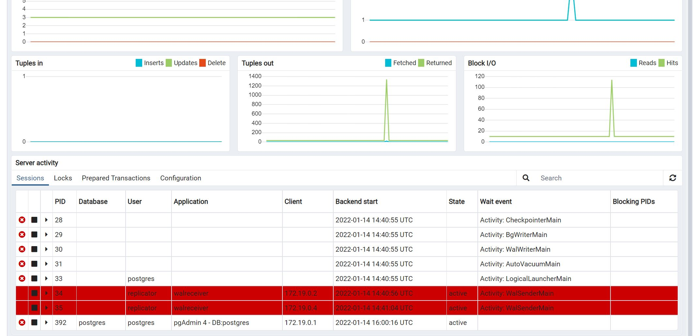

# Entity Framework Core and Leader-Followers Data Replication
## Introduction
In order to horizontally scale a RDBMS-based data tier application, a common solution is to asymetrically split the load between different nodes, in such a way that queries are routed to real-time replicated databases and the writes to the "leader" one. This leaves it with mainly two responsibilities:

- Process all the writes. 
- Ship the WAL (write ahead log ) to the connected replicas. 

Postgresql supports [replication](https://www.postgresql.org/docs/9.2/runtime-config-replication.html) since version 9, both in asynchrnous (default) or synchronous modes. Synchronous executes replication within the write transaction, so a distributed lock is in fact happening: if for some reason a replica takes too long to replicate, clients of the leader node will be effectively blocked. 
On the other hand, asynchronous favours availability at the price of eventual consistency of the data.

The pros of this solution are obvious, as it allows to easily add new readonly nodes to physically distribute the query load. But, unfortunately, there're drawbacks too, as the replication lag has to be closely monitored if the data 
that the replicas will be serving needs to be very up-to-date. If a replica's replication lag starts growing, the replica should be retired, adding significant load to the remaining actors. There're also some other concerns to consider, such as 

- Beware of [read your own writes](https://docs.oracle.com/cd/E17076_05/html/gsg_db_rep/C/rywc.html) casuistics. 
- [Monotonic reads](https://jepsen.io/consistency/models/monotonic-reads#:~:text=Monotonic%20reads%20ensures%20that%20if,reads%20by%20the%20same%20process.) are not warranted.
- This might be obvious, but you've to be careful that within any transactional application flow with writes, all the data has to be retrieved from the leader.
- Migration handling might be sketchy.
- What happens if the leader node goes down?

## Experiment / POC

Here I am setting up a docker based  leader + two replicas postgresql cluster. In order to start it, run the commands in `postgresScript.ps1`; you will be promted a few times to introduce the password which is "secret" . 
On the application side, it already includes the connection strings to these, so it's a matter of running it.

Once you start the program, a very simple Blog/Post/Comment model will be configured, and the migrations will be executed on the leader node. The replication process will take care of reproducing these tables in both replicas. Once the setup is finished, two different threads will start adding load to the system:

- A first task will start creating data, with two parallel subtasks:

```var continuousDataCreation = Parallel.ForEachAsync(Enumerable.Range(1, 2), new ParallelOptions() { MaxDegreeOfParallelism = 2 }, async (value, token) =>
{
    while (true)
        using (var scope = app.Services.CreateScope())
        {
            var dataSeeder = scope.ServiceProvider.GetRequiredService<RandomDataGenerator>();
            await dataSeeder.Run(CancellationToken.None);
            Thread.Sleep(Random.Shared.Next(100, 2000));
        }
});
```

A second task starts querying data randomly. It also has parallelism, which is set up to 100:

```
var continuousQueryLoad = Parallel.ForEachAsync(Enumerable.Range(1,100), new ParallelOptions() {  MaxDegreeOfParallelism = 100 }, async (value, token)  =>
{
    var random = Random.Shared;
    var range = Enumerable.Range(random.Next(1, 10000), random.Next(1, 20));

    while (true)
        using (var scope = app.Services.CreateScope())
        {
            var dbContext = scope.ServiceProvider.GetRequiredService<DbContextFactory>().GetReadOnlyDbContext();
            await dbContext.Posts.Skip(Random.Shared.Next(1, 1000)).Take(Random.Shared.Next(1,20)).Include(x => x.Comments).ToListAsync();
        }
});
```
The queries are round-robin balanced between the two read replicas, because of the `DbContextFactory.GetReadOnlyDbContext()` method:

```
public ReadOnlyDbContext GetReadOnlyDbContext()
    {
        var optionsBuilder = new DbContextOptionsBuilder<ReadOnlyDbContext>();
        optionsBuilder.UseNpgsql(_replicasConnectionBuffer.GetNext());

        return new ReadOnlyDbContext(optionsBuilder.Options);
    }
```
It's worth noting that EF Core doesn't have a native solution to consume this kind of architecures, so this mechanism had to be implemented. 
Though I am doing this at application side, you would typically do this at proxy level with some tech such as pgpool or HaProxy. I am not sure how you would retire a unsynchronized replica this way, probably you would need to do this at application level.

In order to monitor the replication lag, there's a small script in LagCheck.ps1 that runs a query periodically over each replica. You can also monitor the nodes cpu usage with the `docker stats` command. As per this POC / experiment, the replication lag tends to be close to zero, unless the host system runs out of resources. This is easily reproducible modifying the load parameters of the main program.

Lastly, the first script also creates a pgAdmin instance (db Client ) on which you can log by accesing to localhost:5050 with the credentials "user@domain.com"/"SuperSecret". 
There, it's a matter of creating three server connections with the "postgres" / "secret" user /PWD to the "host.docker.internal" localhosts with ports 5432, 5480 and 5490. 

I found interesting that each replica creates a process in the master node using the "replicator" user that is set up for this task:




